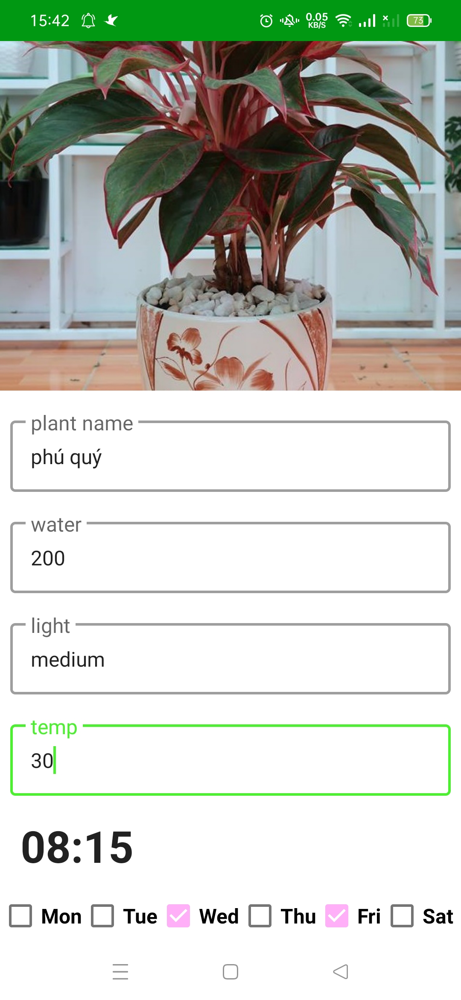
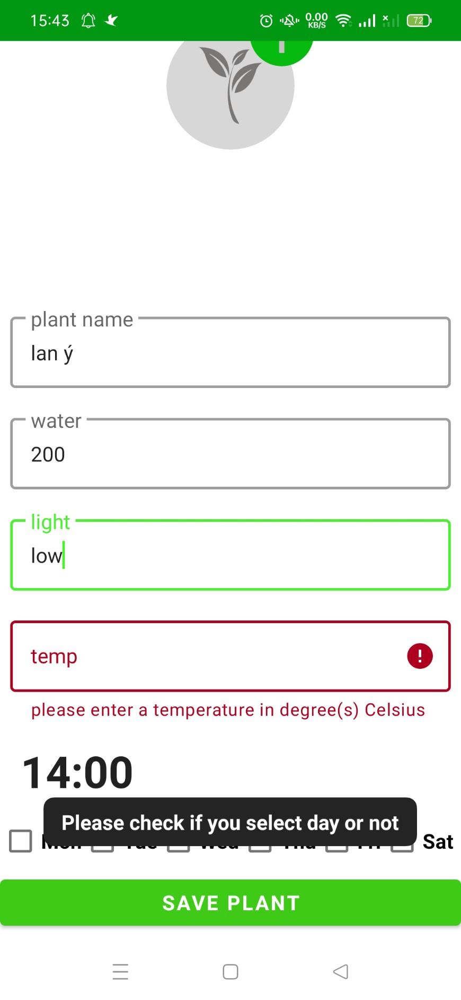
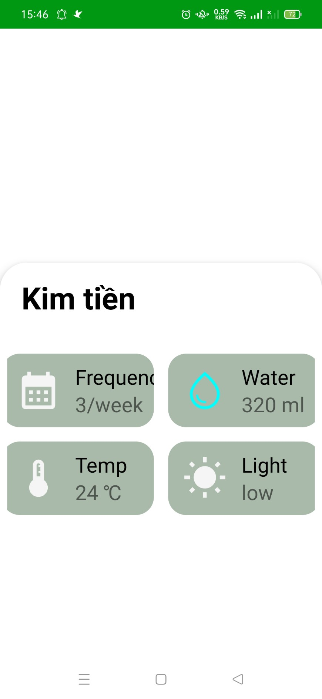
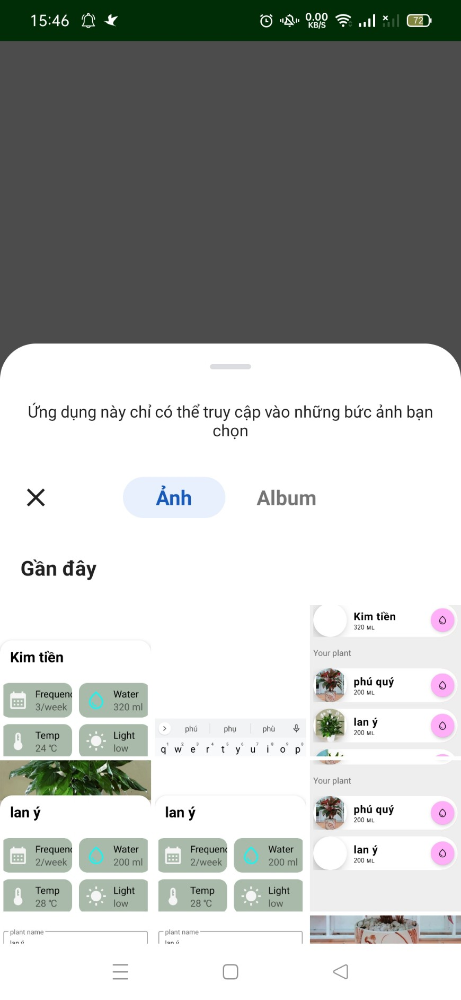
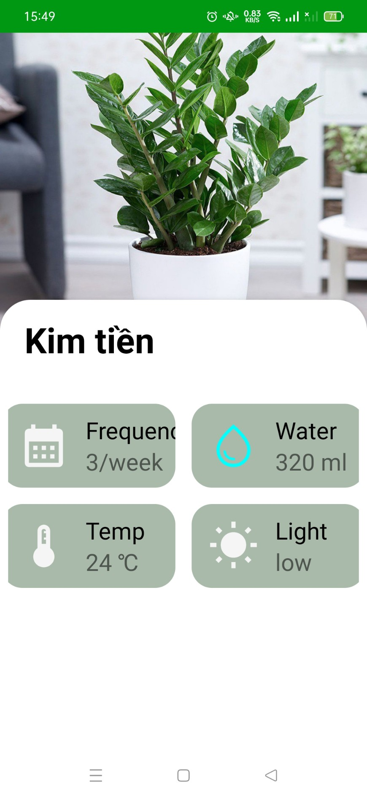
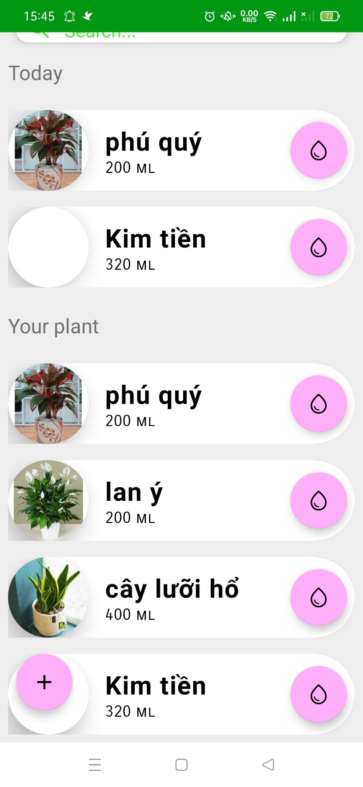
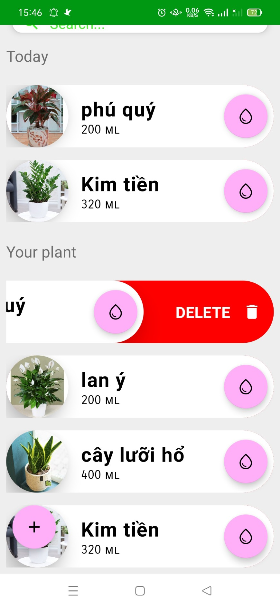

# Water plant reminder app

## An app supports the user by notifying them about the time to water their plant
 
this is a small project made by myself to improve my program skill so it has some features. However, I will update new feature on soon
 
Main feature: 

* create new plant reminder 
* notify user when the time comes
* search the plant you need by name
* showing the plants need to water today
* remove reminder by swipe

## Screenshots
<table>
    <tr>
        <th> </th>
        <th> </th>
        <th> </th>
    </tr>
    <tr>
        <th> </th>
        <th> </th>
        <th> </th>
    </tr>
    <tr>
        <th> </th>
        <th> </th>
    </tr>
</table>

## How to install the project
1. clone this project
2. open this project with android studio and run

Note: please set your minSdk >= 26 in your build.gradle file 

